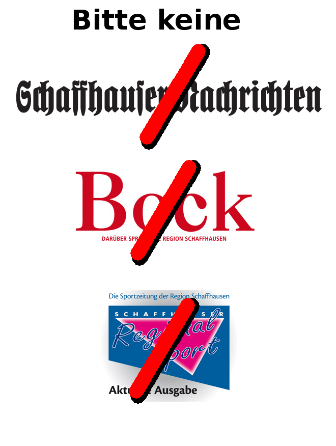

Was
===

Ein Flyer/Kleber, den man an den Briefkasten
anmachen kann, damit man keine...

* Schaffhauser Nachrichten
* Schaffhauser Bock
* Schaffhauser Regional Sport

... Zeitungen mehr kriegt:

Formate
=======

Der Flyer liegt sowohl im PNG Format zum
einfach ausdrucken, als auch im Gimp
Quellformat vor, damit man den Flyer selbst
anpassen kann, wenn man will.

Quellen
=======

Die im Flyer verwendeten Bilder wurden von den
folgenden URLs runtergeladen:

* http://www.shn.ch/sites/default/files/shn_logo_0.png
* http://www.bockonline.ch/images/logo.png
* http://www.srs-verlag.ch/images/logo_rs.jpg

Die Urheberrechte der Logos liegen bei den jeweiligen Zeitungen!
